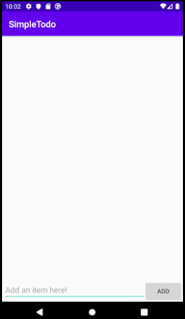

# Project - *Todo App*

**Todo App** is an android app that allows building a todo list and basic todo items management functionality including adding new items, editing and deleting an existing item.

Submitted by: **Om Pathak**

Time spent: **3.5** hours spent in total

## User Stories

The following **required** functionality is completed:

* [x] User can **view a list of todo items**
* [x] User can **successfully add and remove items** from the todo list
* [x] User's **list of items persisted** upon modification and and retrieved properly on app restart

The following **optional** features are implemented:

* [x] User can **tap a todo item in the list and bring up an edit screen for the todo item** and then have any changes to the text reflected in the todo list

The following **additional** features can be implemented:

* [ ] User can **create list of items for different categories
* [ ] User can **add deadlines/due dates to each item
* [ ] User can **make particular items/tasks high priority 
* [ ] User can **add and then see progress for each item on the list
* [ ] User can **connect this app with other apps for example: messages and email
* [ ] User can **use this app as an widget on the home screen
* [ ] User can **add passcode protection for some secret items/tasks
* [ ] User can **add pictures to a group or a particular item/task
* [ ] Improve the UI/UX of the app and make it more appealing to the user 
## Video Walkthrough

Here's a walkthrough of implemented user stories:

GIF created with [LiceCap](http://www.cockos.com/licecap/).

## Notes

Describe any challenges encountered while building the app.
The app was very simple to build, but you can always run into import problems and running the emulator on low-end apps can be annoying. 
The Android Studio is very user-friendly and easy to use. It also gives the developer a lot of freedom to play around with the UI. 

## License

    Copyright [yyyy] [name of copyright owner]

    Licensed under the Apache License, Version 2.0 (the "License");
    you may not use this file except in compliance with the License.
    You may obtain a copy of the License at

        http://www.apache.org/licenses/LICENSE-2.0

    Unless required by applicable law or agreed to in writing, software
    distributed under the License is distributed on an "AS IS" BASIS,
    WITHOUT WARRANTIES OR CONDITIONS OF ANY KIND, either express or implied.
    See the License for the specific language governing permissions and
    limitations under the License.
